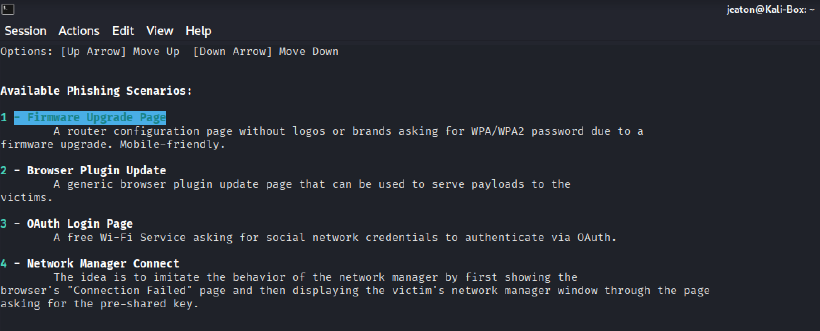
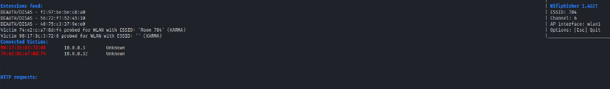
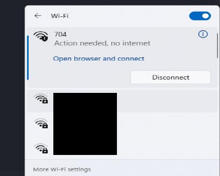
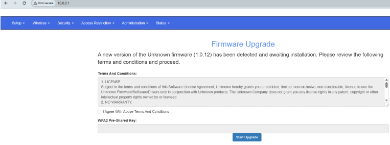
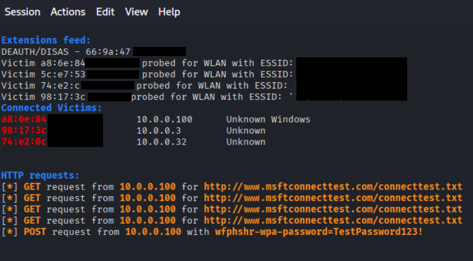

# The Wi-Fi is Gaslighting You: an MITM Project

For my Capstone, the assignment sounded simple: intercept wireless traffic.

Translation: become the villain in your own living room.

But instead of writing a dry “packets were captured successfully 🤓☝️” report, I found something way more interesting:

Your Wi-Fi doesn’t betray you in this attack.
You betray yourself.

This project focuses on an Evil Twin Man-in-the-Middle (MITM) attack. We're not doing this by cracking encryption like a movie hacker. We're exploiting the fact that humans will type their Wi-Fi password anywhere if the pop-up feels urgent enough.

And honestly? That’s the real vulnerability.

## Why I Chose This (The "Work Smarter, Not Harder" Defense)

Could I have tried brute-forcing a WPA2 handshake?

Sure.

Could I have waited until 2047 for it to finish?

Maybe.

Instead, I chose the Evil Twin approach because it doesn’t fight encryption — it sidesteps it completely.

Strong WPA2 password?

**Doesn’t matter.**

If I can:

1.) Kick you off your real Wi-Fi

2.) Clone the same network name (SSID)

3.) Show you a convincing “Router Firmware Update” page

There’s a high chance you will willingly type your own password into my fake portal.

No math or cracking encryption. It's just good ole fashioned human psychology.

What we should really find interesting is that this method demonstrates something important:

> Social engineering consistently outperforms technical brute force because it exploits *trust*, not software.

## The Methodology: Bro is NOT cracking WPA2

### Step 1: Toolmaxxing

Opened Kali.

Cloned wifiphisher.

> git clone https://github.com/wifiphisher/wifiphisher.git
> cd wifiphisher
> sudo python setup.py install

Kali immediately said dependencies were missing.

Installed them (through research and AI help):

> sudo apt-get install libssl-dev libnl-3-dev libnl-genl-3-dev

Dependencies = things your code needs before it can perform.

Tool installed.

I forgot to screenshot me doing this install but you can trust it happened.

Here’s what it looks like once it finishes successfully:

### Step 2: Patchmaxxing roguehostapd

Evil Twin requires:

* One adapter = deauth (network eviction notice)
* One adapter = rogue access point (identity theft for Wi-Fi)

After much deliberation with Google and ChatGPT, I found that roguehostapd kept breaking because of an outdated "ConfigParser" module.

One import line was wrong.

One.

Changed it to modern "configparser".

Everything worked.

Almost defeated by case sensitivity, but we persist.

### Step 3: Adaptermaxxing (dual-wield build)

Plugged in the two USB Wi-Fi adapters.

Verified they were recognized:

> ip link show
> iwconfig

If they don’t show here, one thing I like to do is adjust my chair and try again.

Launched wifiphisher.

Selected target network (redacted because we don't dox our neighbors).

Chose the Firmware Upgrade Page scenario.

The attack logic is simple:

Disconnect victim → Clone SSID → Present urgency → Wait.

We're not breaking WPA2.

We're taking advantage of user trust.

### Step 4: Deauthmaxxing

Adapter #1 began deauthing the real network.

Translation: It told everyone "you need to leave".

Adapter #2 broadcasted the cloned SSID.

Same name, same signal vibe, just different intentions.

My machine got kicked off.

Immediately reconnected... to the fake one.

Because devices see:

> familiar name = safe.

My machine got kicked off.

It immediately reconnected... to the fake one.

Because devices see:

> familiar name = safe.

### Step 5: Windows tried awarenessmaxxing

Modern Windows did not immediately fold.

It redirected to a connectivity check site (msn.com) instead of loading my fake portal.

Respectable.

So I manually navigated to the gateway:

> 10.0.0.1

Forced the captive portal to display.

Fake firmware update page loads.

Convincing, yet mildly annoying.

Exactly the aesthetic attackers want.

### Step 6: Credential farming complete

Entered a dummy password:

> TestPassword123!

Kali terminal immediately displayed it in cleartext.

Meanwhile the browser said:

> Firmware upgrade in progress…

The victim is watching a loading bar while his keys are already gone.

That’s it.

## What This Actually Demonstrates

This wasn’t brute-force maxxing.

It was human behavior maxxing.

WPA2 encryption is strong.

But:

* Familiarity bias
* Urgency
* Automatic reconnection behavior

Those are predictable.

Predictability = farmable.

Modern OS protections made setup harder than the attack itself.

The technical barrier is rising.

The human barrier is stable.

## How to Not Get Farmed

If your Wi-Fi:

• randomly disconnects
• reconnects as “Open”
• asks for your password in a browser

Do not do anything

Pause.

Breathe. 

Look.

Verify.

Because the attacker is not always going to try to break your machine.

In this instance, he's just trustmaxxing.

And if you type your password into a pop-up without thinking, you are NOT being hacked.

You are being **harvested**.
